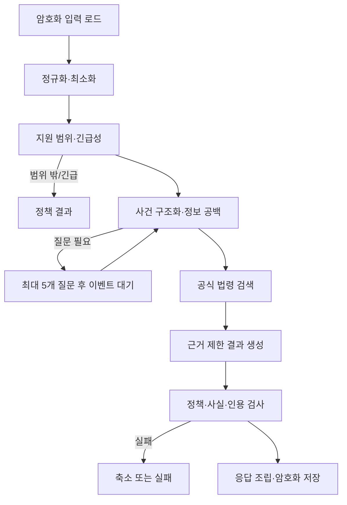

# AI 분석 파이프라인

- Orchestrator: Cloudflare Workflows
- Model path: Cloudflare AI binding -> AI Gateway Unified Billing -> third-party model
- Initial model: `openai/gpt-6-sol`, reasoning `medium`

## 단계

## 단계 계약

| 단계 | 입력 | 구조화 출력 | 실패 원칙 |
| --- | --- | --- | --- |
| 최소화 | 사용자 서술 | 분석에 필요한 문장, 마스킹 힌트 | 원문은 로그 금지 |
| screening | 최소화 입력 | `inScope`, `urgency`, reason code | 불명확하면 질문, 안전 신호 우선 |
| structure | 입력·답변 | 당사자 역할, 금액, 날짜, 약정, 이행, 증거, unknowns | 없는 사실을 채우지 않음 |
| questions | unknowns | 0~5개의 영향도 높은 질문 | 5개 초과 거부 |
| retrieval | 검색어·기준일 | 검증된 law chunks | 공식 출처 없으면 주장 금지 |
| generation | 구조화 사건·chunks | 결과 초안 | 제공 근거 밖의 법률 주장 금지 |
| validation | 초안·근거·정책 | pass, findings, sanitized result | critical finding이면 fail closed |

각 출력은 `schemaVersion`이 있는 strict JSON Schema이며 Zod로 다시 파싱한다.
Structured Outputs는 형식을 보장하는 도구일 뿐 사실성과 안전성을 보장하지 않는다.
질문 묶음·24시간 대기·revision·결과 union의 한도는 [실행 계약](./DOMAIN-LIFECYCLE.md)
정본을 따른다. #28이 strict schema와 합성 fixture를 선행 제공하며 다른 모듈은 재정의하지 않는다.

## 프롬프트·모델 버전

- 프롬프트는 단계별 파일과 semantic version을 가진다.
- 결과 메타데이터에 model ID, prompt/schema/policy version, retrieval hash를 저장한다.
- temperature 등 지원 파라미터는 adapter 내부 상수이며 문서화되지 않은 값을 보내지
  않는다.
- 모델 ID 또는 reasoning effort 변경은 고정 평가셋 전체 통과와 ADR을 요구한다.

## 사실 구분

모든 구조화 사실은 `source: user | official_source | ai_organization`과
`confidence: stated | verified | inferred | unknown`을 가진다. `inferred`는 사건 사실로
서술하지 않고 사용자에게 확인 필요로 표시한다. 날짜·금액 정규화는 원문 값도 함께
보존해 오해를 검토할 수 있게 한다.

## 법률 근거 제한

- generation에 전달하는 법률 내용은 [법률정보 검색](./LEGAL-RETRIEVAL.md)이 검증한
  chunk뿐이다.
- 모델이 만든 citation 식별자는 allowlist의 내부 ID와 정확히 일치해야 한다.
- citation validator가 법령명, 조문, 시행일, URL, 주장 연결을 검사한다.
- 근거가 약한 문장은 삭제하거나 `공식 자료에서 확인하지 못함`으로 바꾼다.

## Gateway 개인정보 설정

모델 호출은 Worker의 AI binding과 환경별 `AI_GATEWAY_ID`를 사용해 AI Gateway
Unified Billing으로 보낸다. 모델 공급자 API key는 발급하거나 저장하지 않는다.
Gateway의 payload logging은 비활성화하고 Gateway·사용자·모델 단위 spend limit을
설정한다. Gateway와 앱 로그에는 request ID, 단계, model, latency, token count,
status, failure code만 허용한다. 사용자 입력·답변·결과·prompt 본문·법률 검색어에
개인 식별 내용이 있으면 기록하지 않는다.
모든 호출에서 `gateway:{id,collectLog:false,skipCache:true}`를 명시하고 Gateway 설정도
검증한다. 호출 shape는 초기 모델의 Chat Completions와 `response_format`으로 고정하며
reasoning은 `medium`, 출력 상한은 단계별로 둔다. Responses 형식을 혼합하지 않는다.
모델 catalog 지원과 실제 JSON Schema 응답은 #15/#27의 live 합성 요청으로 검증한다.
provider 보존/무학습 설정은 Gateway 로그 설정과 별도로 법률/계약 검증 대상이다.

## 재시도와 timeout

- 네트워크, 429, 명시적 5xx만 제한 횟수의 지수 backoff로 재시도한다.
- schema 실패는 같은 단계에서 1회 교정 시도 후 실패한다.
- policy/citation 실패는 같은 초안을 반복 호출하지 않고 안전하게 축소하거나 실패한다.
- Workflow step은 암호화 checkpoint/reference와 결과 hash를 재사용한다. 외부 호출 성공과
  checkpoint commit 사이의 crash는 중복 과금이 가능하므로 exactly-once를 보장하지 않는다.
  최대 attempt·timeout·quota 규칙은 DOMAIN-LIFECYCLE을 따른다.
- 모델 fallback은 없다. 공급자 장애는 `MODEL_UNAVAILABLE`로 종료하고 사용자 재시도를
  허용한다.

## 안전 정책

차단 또는 대체 대상:

- 승소 확률, 법적 결론, 변호사 행세, 특정 행동의 보장
- 사용자가 제공하지 않은 사실을 확정적으로 추가
- 개인정보 재노출 또는 입력에 없는 민감정보 생성
- 지원 법역·사건 유형 밖의 구체적 적용
- 출처가 없는 법률 주장이나 위조된 링크
- 긴급 안전 신호를 무시한 일반 분석

## 완료 조건과 평가

결과는 schema, scope, fact attribution, citation integrity, prohibited-output 검사를 모두
통과해야 `completed`가 된다. 테스트 전략의 50개 이상 고정 평가셋에서 critical
failure가 하나라도 있으면 배포를 막는다. 샘플·프롬프트·예상 정책 결과는 버전 관리하되
실제 사용자 데이터를 평가셋으로 복사하지 않는다.
