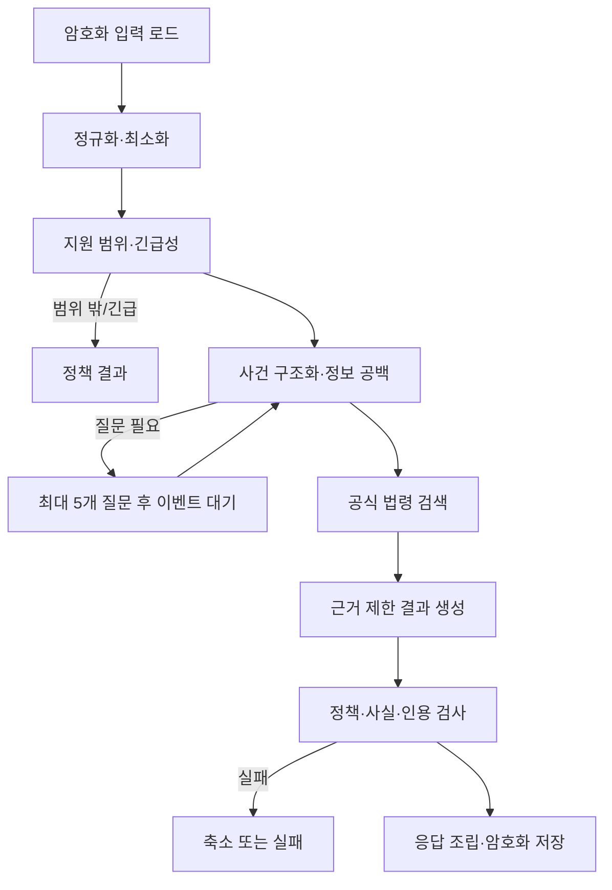

# AI 분석 파이프라인

> **2026-10-07 사용자 후속 — 이전 비용 정책보다 우선:** 계정별 AI 응답은 KST 하루200회이며 Preview/Production의 별도 전체 월 예산 차단은 해제한다. Cloudflare 기존 결제 경로에서 잔액$10 이하 시$30 자동 충전을 사용자가 직접 승인/설정했다. metering·실제 funding·가격/FX·bounded attempt·unknown 비용 보존은 유지한다. 배포 설정 `MONTHLY_BUDGET_CAP_ENABLED=false`가 예약·사용량·정산에 일관되게 적용된다. 기존 allocation 금액은 이 모드에서 소비 차단 한도가 아니며 schema0009의 기록을 보존한다.

- Orchestrator: Cloudflare Workflows
- Model path: Cloudflare AI binding -> AI Gateway Unified Billing -> third-party model
- Initial model: `openai/gpt-6-sol`, reasoning `medium`

아래 기존 단일 사건 분석은 v1이다. v2의 연속 작업과 multimodal 목표는 마지막 확장을
따르며 실제 모델 지원/응답/안전 품질은 live 증거로 확인한다. model 이름이나 문서만으로
vision·ASR·공급자 개인정보 조건을 통과한 것으로 기록하지 않는다.

## 단계

## 단계 계약

| 단계 | 입력 | 구조화 출력 | 실패 원칙 |
| --- | --- | --- | --- |
| 최소화 | 사용자 서술 | 분석에 필요한 문장, 마스킹 힌트 | 원문은 로그 금지 |
| screening | 최소화 입력 | `inScope`, `urgency`, reason code | 불명확하면 질문, 안전 신호 우선 |
| structure | 입력·답변 | 당사자 역할, 금액, 날짜, 약정, 이행, 증거, unknowns | 없는 사실을 채우지 않음 |
| questions | unknowns | 0~5개의 영향도 높은 질문 | 5개 초과 거부 |
| retrieval | 검색어·기준일 | 검증된 law chunks | 공식 출처 없으면 주장 금지 |
| generation | 구조화 사건·chunks | 결과 초안 | 제공 근거 밖의 법률 주장 금지 |
| validation | 초안·근거·정책 | pass, findings, sanitized result | critical finding이면 fail closed |

각 출력은 `schemaVersion`이 있는 strict JSON Schema이며 Zod로 다시 파싱한다.
Structured Outputs는 형식을 보장하는 도구일 뿐 사실성과 안전성을 보장하지 않는다.
질문 묶음·24시간 대기·revision·결과 union의 한도는 [실행 계약](./DOMAIN-LIFECYCLE.md)
정본을 따른다. #28이 strict schema와 합성 fixture를 선행 제공하며 다른 모듈은 재정의하지 않는다.

## 프롬프트·모델 버전

- 프롬프트는 단계별 파일과 semantic version을 가진다.
- 결과 메타데이터에 model ID, prompt/schema/policy version, retrieval hash를 저장한다.
- temperature 등 지원 파라미터는 adapter 내부 상수이며 문서화되지 않은 값을 보내지
  않는다.
- 모델 ID 또는 reasoning effort 변경은 고정 평가셋 전체 통과와 ADR을 요구한다.

## 사실 구분

모든 구조화 사실은 `source: user | official_source | ai_organization`과
`confidence: stated | verified | inferred | unknown`을 가진다. `inferred`는 사건 사실로
서술하지 않고 사용자에게 확인 필요로 표시한다. 날짜·금액 정규화는 원문 값도 함께
보존해 오해를 검토할 수 있게 한다.

## 법률 근거 제한

- generation에 전달하는 법률 내용은 [법률정보 검색](./LEGAL-RETRIEVAL.md)이 검증한
  chunk뿐이다.
- 모델이 만든 citation 식별자는 allowlist의 내부 ID와 정확히 일치해야 한다.
- citation validator가 법령명, 조문, 시행일, URL, 주장 연결을 검사한다.
- 근거가 약한 문장은 삭제하거나 `공식 자료에서 확인하지 못함`으로 바꾼다.

## Gateway 개인정보 설정

모델 호출은 Worker의 AI binding과 환경별 `AI_GATEWAY_ID`를 사용해 AI Gateway
Unified Billing으로 보낸다. 모델 공급자 API key는 발급하거나 저장하지 않는다.
Gateway의 payload logging은 비활성화하고 Gateway·사용자·모델 단위 spend limit을
설정한다. Gateway와 앱 로그에는 request ID, 단계, model, latency, token count,
status, failure code만 허용한다. 사용자 입력·답변·결과·prompt 본문·법률 검색어에
개인 식별 내용이 있으면 기록하지 않는다.
모든 호출에서 `gateway:{id,collectLog:false,skipCache:true}`를 명시하고 Gateway 설정도
검증한다. 호출 shape는 초기 모델의 Chat Completions와 `response_format`으로 고정하며
reasoning은 `medium`, 출력 상한은 단계별로 둔다. Responses 형식을 혼합하지 않는다.
모델 catalog 지원과 실제 JSON Schema 응답은 #15/#27의 live 합성 요청으로 검증한다.
provider 보존/무학습 설정은 Gateway 로그 설정과 별도로 법률/계약 검증 대상이다.

## 재시도와 timeout

- 네트워크, 429, 명시적 5xx만 제한 횟수의 지수 backoff로 재시도한다.
- schema 실패는 같은 단계에서 1회 교정 시도 후 실패한다.
- policy/citation 실패는 같은 초안을 반복 호출하지 않고 안전하게 축소하거나 실패한다.
- v2 intake는 새로 생성한 한 문항이 기존 질문과 정규화 후 중복되는지 검사한다. 중복이거나
  생성 결과의 내부 검증이 실패하면 사유 코드만 전달해 새 초안을 1회 재생성하고
  사실·개인정보·정책 검사와 독립 audit를 다시 수행한다. 공급자의 refusal은 자동 재생성하지 않는다.
- 질문 audit는 질문과 선택지를 평가한다. 사용자 입력에 전략·분쟁·민감 정보가 있다는
  사실이나 질문 묶음이 전체 요약을 포함하지 않는다는 이유만으로 거절하지 않는다.
  실제 생성된 법률 전략·근거 없는 주장·개인정보 노출은 계속 차단한다.
- `POLICY_REJECTED` intake 작업은 저장한 답변을 유지하며 사용자가 같은 작업을 총 3회
  실행 한도 안에서 재시도할 수 있다. 이전에 retryable=false로 저장된 intake 실패에도
  적용하며 chat/파일/리포트에는 확대하지 않는다. 추가 모델 호출은 각각 실제 비용을
  예약·정산하고 기존 소유권·revision·quota·삭제·lease 검증을 유지한다.
- v2 workspace는 유료 단계마다 유효한 5분 lease를 갱신한다. 최대 4개 생성/audit
  단계를 허용하는 Workflow의 외부 timeout은 20분이며 단계별 호출 횟수·60초 timeout은
  늘리지 않는다. 검증 중인 초안은 Workflow step 상태나 사용자에게 노출하지 않는다.
- Workflow step은 암호화 checkpoint/reference와 결과 hash를 재사용한다. 외부 호출 성공과
  checkpoint commit 사이의 crash는 중복 과금이 가능하므로 exactly-once를 보장하지 않는다.
  최대 attempt·timeout·quota 규칙은 DOMAIN-LIFECYCLE을 따른다.
- 모델 fallback은 없다. 공급자 장애는 `MODEL_UNAVAILABLE`로 종료하고 사용자 재시도를
  허용한다.

## 안전 정책

차단 또는 대체 대상:

- 승소 확률, 법적 결론, 변호사 행세, 특정 행동의 보장
- 사용자가 제공하지 않은 사실을 확정적으로 추가
- 개인정보 재노출 또는 입력에 없는 민감정보 생성
- 지원 법역·사건 유형 밖의 구체적 적용
- 출처가 없는 법률 주장이나 위조된 링크
- 긴급 안전 신호를 무시한 일반 분석

## 완료 조건과 평가

결과는 schema, scope, fact attribution, citation integrity, prohibited-output 검사를 모두
통과해야 `completed`가 된다. 테스트 전략의 50개 이상 고정 평가셋에서 critical
failure가 하나라도 있으면 배포를 막는다. 샘플·프롬프트·예상 정책 결과는 버전 관리하되
실제 사용자 데이터를 평가셋으로 복사하지 않는다.

## v2 연속 사건 이해와 navigation

[ADR-0006](../adr/0006-continuous-case-workspace-and-navigation.md)의 상태와
[v2 실행 계약](./V2-CONTRACTS.md)을 사용한다. workspace를 완료 terminal로 닫지 않고
intake/question job, summary review, confirmed summary, chat/action job, file interpretation,
report snapshot을 독립 versioned operation으로 나눈다. 2026-10-07 사용자 요청에 따라
새 intake는 한 번에 한 문항, 총 최대 두 후속 질문 뒤 사용자 요약 확인을 받는다.
모름·건너뛰기도 한도에 포함하고 남은 정보 공백은 요약에 보존한다. 기존 사건의 저장된
질문·답변은 그대로 읽고 수정할 수 있다. 이후에도 질문·사실 수정·자료 추가를 계속 처리한다.

| 단계 | 최소 입력·출력 | 확정/실패 경계 |
| --- | --- | --- |
| intake understanding | broad category/당사자·목표·사건 경위·unknown | 모든 한국 법률 분야를 수용, 불명확한 taxonomy가 자동 범위 탈락을 만들지 않음 |
| adaptive questions | 현재 facts/답변/누락 → 한 묶음 question IDs/types | unknown/skipped 유지, 이미 답한 질문 반복 제한, partial draft 재개 |
| summary review | 사용자 진술·자료 관찰·추정·상충/불리한 사실 분리 | 최신 revision 사용자 확인 전 navigation 없음 |
| chat/navigation | 확정 snapshot+새 message+선택자료 → facts/action diff+응답 | source attribution, 안전한 action catalog, 법률 결론·승패/협상/소송 전략 차단 |
| file interpretation | 추출 text/frame/ASR 구간 → 관찰·불확실성·source reference | 원본 진정성·모든frame완전판독·음성발화자 신원 확정 주장 금지 |
| report assembly | 검증 snapshot+사용자 편집/선택 → factual report | 저장 결과를 재현, 법률 주장만 공식 source 검증, 실패 법률 문장 제거 |

공식 인용이 없는 사실 정리와 단순 파일 목록/PDF는 모델 지식으로 법률 결론을 보충하지
않고 진행할 수 있다. 공식 source 장애가 있는 법률 설명은 제외하거나 확인 불가로 표시한다.
policy/citation/fact critical failure가 있는 초안을 채팅에 그대로 streaming하지 않는다.
operation이 실패해도 사용자 message·원본 자료·이전 확정 결과는 보존하고 재시도/보완을 안내한다.

## v2 multimodal 경로와 실제 지원 확인

모든 모델 호출은 `llm-gateway`가 소유한다. 기존 pinned text/vision 후보 모델의 Gateway
Unified Billing 경로와 reasoning medium을 유지한다. vision은 실제 account/model의 입력
shape·이미지 byte/token 제한·응답 schema·개인정보/저장 조건을 합성 이미지로 먼저 검증한다.
문서에서 명시하지 않은 raw PDF/동영상 업로드 기능이나 자동 fallback 모델은 가정하지 않는다.
검증 실패는 capability blocker이며 텍스트만 처리한 결과를 완전한 영상 분석으로 표시하지 않는다.

[ADR-0010](../adr/0010-multimodal-ai-and-transcription.md)의 ASR 목표는
`@cf/openai/whisper-large-v3-turbo`이며 audio 분할/합성 입력은 Container에서 준비하고
Workers의 `llm-gateway` adapter가 호출한다. Cloudflare-hosted Workers AI 경로를 기존
third-party text Gateway와 구분해 실제 호출·과금·log/보존·처리 국가를 검증한다. 공식
출력의 text/segments/VTT를 source 구간으로 파싱하되 timestamp·한국어 인식·silence/오인식
안전 처리는 실제 fixture와 live로 확인한다. [ASR 모델](https://developers.cloudflare.com/workers-ai/models/whisper-large-v3-turbo/)

영상은 전체 오디오를 구간별로 전사하고 매1초+장면전환 frame을 batch로 해석한다. timestamp
offset·frame index·관찰/추출 source 위치를 유지하고 전체 길이 대비 processed/failed 구간을
manifest에 기록한다. 비슷한 frame dedup은 원래 timestamp coverage를 지우지 않는다.
다운샘플·빈 frame·silence·부분 실패는 UI/PDF에도 남긴다. 법원 유불리·증거능력·발화자
식별·위변조 여부 판단은 변호사 검토 대상으로 남긴다.

## 처리 격리·quota·삭제

Container는 문서/OCR/office 변환·오디오/영상 추출·PDF/ZIP 구성의 독립 Node 런타임이며
직접 AI/법률 API key나 영구 사건 키를 받지 않는다. job-scoped gateway의 제한된 자료를
일시 복호화하고 암호화 파생물만 반환한다. 원본 파일 안의 지시·링크·매크로·HTML은 실행
명령이 아니며 외부 network/SSRF·prompt injection을 막는다.

logical visible response를 하루200회 reservation에 묶고 internal phase/교정/retry는 사용자
quota를 반복 차감하지 않는다. 모든 provider/ASR/Container attempt 비용은 월100만원 ledger에
별도 반영한다. bounded phaseattempt·joblease·global 비용 예약과 snapshot 재사용을 둔다.
원본/계정 삭제 또는 revision 변경 후 늦은 completion은 source guard로 거부하며 Workflow
step/Container state에서 plaintext를 삭제한다. 제한 수치와 재개/cleanup은
[v2 실행 계약](./V2-CONTRACTS.md)의 정본을 따른다.
