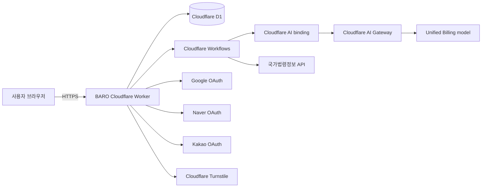

# 시스템 설계

- Status: Implementation-ready
- Related decisions: [ADR-0001](../adr/0001-mvp-system-boundaries-and-ai-pipeline.md), [ADR-0002](../adr/0002-web-stack-and-cloudflare-runtime.md)

## 컨텍스트



Astro UI, Better Auth, Hono API는 하나의 Worker 안에서 동작한다. Workflow는 같은
애플리케이션의 장기 실행 경계이며 별도 제품 서비스가 아니다.

## 저장소 목표 구조

```text
src/
  pages/                 Astro routes
  components/            Astro/React UI
  server/
    api/                  Hono route composition
    auth/                 Better Auth configuration
    db/                   Drizzle schema, repositories
    crypto/               encrypted field envelope
    modules/
      intake/
      case-structure/
      legal-retrieval/
      guidance/
      policy/
      citation/
      llm-gateway/
      response/
  workflows/              analysis workflow entry and steps
  contracts/              shared Zod request/result schemas
drizzle/                  generated SQL migrations
tests/fixtures/legal/     verified non-production legal fixtures
```

의존성 방향은 `UI/API -> application modules -> repositories/adapters`다. 도메인 모듈은
Astro, Hono, Drizzle, Cloudflare AI binding 객체를 직접 반환하지 않는다. `llm-gateway`만 모델
클라이언트를 알고 `legal-retrieval`만 국가법령정보 adapter를 안다.

## 요청 경로

### 짧은 HTTP 요청

1. Hono middleware가 request ID, 세션, 동의 버전, rate limit을 확인한다.
2. route의 Zod 스키마가 입력을 파싱한다.
3. application service가 소유권과 상태 전이를 검증한다.
4. repository가 D1을 읽거나 쓴다.
5. 표준 응답 또는 표준 오류를 반환한다.

### 분석 요청

1. 사건 생성 시 Turnstile, 길이, 일일 사용량을 원자적으로 확인한다.
2. 암호화된 사건과 `analysis` 레코드를 만들고 Workflow instance ID를 저장한다.
3. Workflow가 범위·긴급성·질문 필요 여부를 계산한다.
4. 질문이 필요하면 `needs_clarification` 상태로 이벤트를 기다린다.
5. 답변 후 법률 검색, 근거 제한 생성, 안전·인용 검사를 거친다.
6. 암호화된 결과와 검증된 공개 인용 메타데이터를 저장하고 완료한다.
7. 브라우저는 상태 API를 지수 backoff로 조회한다.

세부 단계는 [AI 파이프라인](./AI-PIPELINE.md)을 따른다.

## Cloudflare bindings와 secrets

| 이름 | 종류 | 환경 | 용도 |
| --- | --- | --- | --- |
| `DB` | D1 binding | 전부 | 애플리케이션 DB |
| `ANALYSIS_WORKFLOW` | Workflow binding | 전부 | 분석 인스턴스 시작·이벤트 |
| `RATE_LIMITER` | Rate limit binding | preview/prod | 짧은 구간 남용 방지 |
| `AI` | AI binding | 전부 | AI Gateway를 통한 Unified Billing 모델 호출 |
| `AI_GATEWAY_ID` | var | 전부 | 환경별 Gateway 식별자 |
| `TURNSTILE_SECRET_KEY` | secret | preview/prod | 서버 토큰 검증 |
| `BETTER_AUTH_SECRET` | secret | 전부 | 세션·인증 서명 |
| `GOOGLE_CLIENT_ID/SECRET` | var/secret | preview/prod | Google OAuth |
| `NAVER_CLIENT_ID/SECRET` | var/secret | preview/prod | Naver OAuth |
| `KAKAO_CLIENT_ID/SECRET` | var/secret | preview/prod | Kakao OAuth |
| `CASE_DATA_KEY_V1` | secret | 전부 | AES-GCM 데이터 키 |
| `LAW_API_OC` | secret | preview/prod | 국가법령정보 API 식별값 |

local은 `.dev.vars`의 가짜/개발 전용 값을 사용하고 파일을 커밋하지 않는다. 환경 간
OAuth client, D1, Gateway, 키를 공유하지 않는다.

## 신뢰 경계

- 브라우저의 사용자 ID, 사건 ID 소유권, usage count, 분석 상태를 신뢰하지 않는다.
- OAuth callback 입력은 Better Auth가 검증한 뒤 사용한다.
- 모델 출력은 타입이 맞더라도 비신뢰 입력으로 취급해 정책·인용 검사를 거친다.
- 법률 API 응답은 schema, source identity, 시행일을 검증한 뒤 캐시한다.
- 로그·이벤트·오류 추적 시스템은 사건 원문을 받을 수 없는 별도 경계다.

## 장애 원칙

- 외부 의존성 timeout은 명시적으로 설정하고 무한 재시도하지 않는다.
- 재시도 단계는 `analysisId + inputRevision + step` 멱등성 키를 사용한다.
- Workflow 재개는 완료된 외부 호출을 중복 과금하거나 usage를 중복 차감하지 않는다.
- 법률 출처·안전 검사 실패는 결과 축소 또는 전체 실패로 닫는다.
- 알 수 없는 사건과 타인 사건은 모두 동일한 404 응답으로 존재를 숨긴다.
