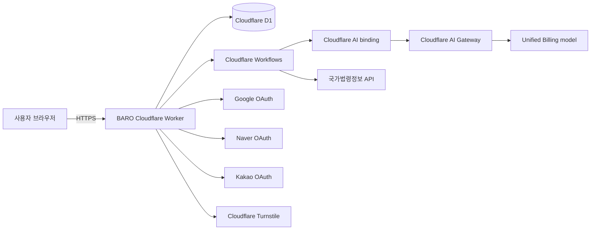
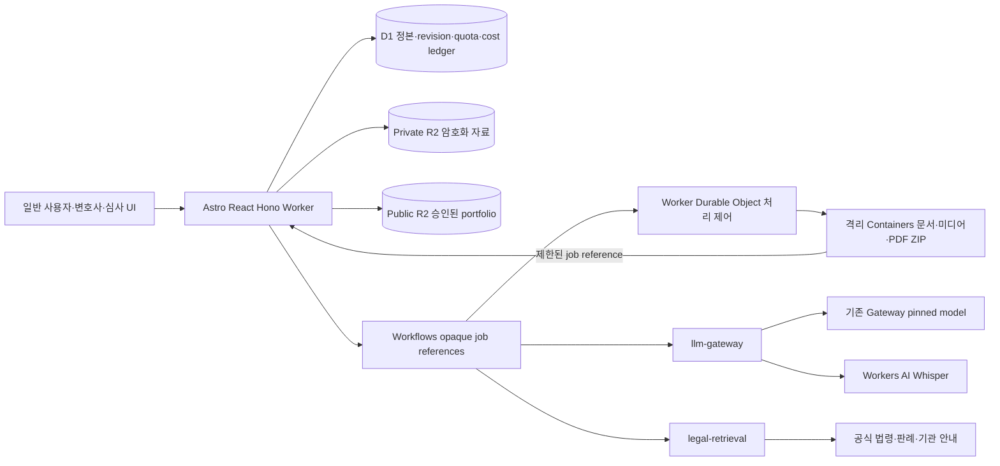

# 시스템 설계

- Status: v1 implemented contract; v2 accepted target pending implementation
- Related decisions: [ADR-0001](../adr/0001-mvp-system-boundaries-and-ai-pipeline.md), [ADR-0002](../adr/0002-web-stack-and-cloudflare-runtime.md)

기존 섹션은 v1 운영/계약의 정본이다. v2는 아래 확장과 [v2 실행 계약](./V2-CONTRACTS.md),
[v2 HTTP API](./V2-HTTP-API.md)를 따른다. 문서의 target binding·Container·새 파일 처리 경로는
아직 배포 증거가 아니며 현재 공개 gate와 v1 데이터·읽기·삭제를 유지한다.

## 컨텍스트



Astro UI, Better Auth, Hono API는 하나의 Worker 안에서 동작한다. Workflow는 같은
애플리케이션의 장기 실행 경계이며 별도 제품 서비스가 아니다.

## 저장소 목표 구조

```text
src/
  pages/                 Astro routes
  components/            Astro/React UI
  server/
    api/                  Hono route composition
    auth/                 Better Auth configuration
    db/                   Drizzle schema, repositories
    crypto/               encrypted field envelope
    modules/
      intake/
      case-structure/
      legal-retrieval/
      guidance/
      policy/
      citation/
      llm-gateway/
      response/
  workflows/              analysis workflow entry and steps
  contracts/              shared Zod request/result schemas
drizzle/                  generated SQL migrations + meta snapshots/journal
tests/fixtures/legal/     verified non-production legal fixtures
```

의존성 방향은 `UI/API -> application modules -> repositories/adapters`다. 도메인 모듈은
Astro, Hono, Drizzle, Cloudflare AI binding 객체를 직접 반환하지 않는다. `llm-gateway`만 모델
클라이언트를 알고 `legal-retrieval`만 국가법령정보 adapter를 안다.

## 요청 경로

### 짧은 HTTP 요청

1. Hono middleware가 request ID, 세션, 동의 버전, rate limit을 확인한다.
2. route의 Zod 스키마가 입력을 파싱한다.
3. application service가 소유권과 상태 전이를 검증한다.
4. repository가 D1을 읽거나 쓴다.
5. 표준 응답 또는 표준 오류를 반환한다.

### 분석 요청

1. 사건 생성 시 인증·동의·Turnstile·길이를 확인한 뒤 D1 batch로 quota와 관련 쓰기를 원자적으로 승인한다.
2. 암호화된 사건과 analysis, idempotency 응답, dispatch outbox를 함께 commit한다.
3. Workflow가 범위·긴급성·질문 필요 여부를 계산한다.
4. 질문이 필요하면 `needs_clarification` 상태로 이벤트를 기다린다.
5. 답변 후 법률 검색, 근거 제한 생성, 안전·인용 검사를 거친다.
6. 암호화된 결과와 검증된 공개 인용 메타데이터를 저장하고 완료한다.
7. 브라우저는 상태 API를 지수 backoff로 조회한다.

세부 단계는 [AI 파이프라인](./AI-PIPELINE.md)을 따른다.
revision·CAS·outbox·삭제 규칙은 [실행 계약](./DOMAIN-LIFECYCLE.md)을 따른다.

## Cloudflare bindings와 secrets

| 이름 | 종류 | 환경 | 용도 |
| --- | --- | --- | --- |
| `DB` | D1 binding | 전부 | 애플리케이션 DB |
| `SESSION` | KV binding | 전부 | Astro adapter session; Better Auth 세션 정본은 D1 |
| `PUBLIC_BETA_ENABLED` | var | production | 공개 기능 gate, 기본 false |
| `ANALYSIS_WORKFLOW` | Workflow binding | 전부 | 분석 인스턴스 시작·이벤트 |
| `RATE_LIMITER` | Rate limit binding | preview/prod | 짧은 구간 남용 방지 |
| `AI` | AI binding | 전부 | AI Gateway를 통한 Unified Billing 모델 호출 |
| `AI_GATEWAY_ID` | var | 전부 | 환경별 Gateway 식별자 |
| `TURNSTILE_SECRET_KEY` | secret | preview/prod | 서버 토큰 검증 |
| `BETTER_AUTH_URL` | var | 전부 | 환경별 OAuth origin과 callback 기준 URL |
| `BETTER_AUTH_SECRET` | secret | 전부 | 세션·인증 서명 |
| `GOOGLE_CLIENT_ID/SECRET` | secret/secret | preview/prod | Google OAuth |
| `NAVER_CLIENT_ID/SECRET` | secret/secret | preview/prod | Naver OAuth |
| `KAKAO_CLIENT_ID/SECRET` | secret/secret | preview/prod | Kakao OAuth |
| `CASE_DATA_KEY_V1` | secret | 전부 | AES-GCM 데이터 키 |
| `LAW_API_OC` | secret | preview/prod | 국가법령정보 API 식별값 |

local은 `.dev.vars`의 가짜/개발 전용 값을 사용하고 파일을 커밋하지 않는다. 환경 간
OAuth client, D1, Gateway, 키를 공유하지 않는다.

## 신뢰 경계

- 브라우저의 사용자 ID, 사건 ID 소유권, usage count, 분석 상태를 신뢰하지 않는다.
- OAuth callback 입력은 Better Auth가 검증한 뒤 사용한다.
- 모델 출력은 타입이 맞더라도 비신뢰 입력으로 취급해 정책·인용 검사를 거친다.
- 법률 API 응답은 schema, source identity, 시행일을 검증한 뒤 캐시한다.
- 로그·이벤트·오류 추적 시스템은 사건 원문을 받을 수 없는 별도 경계다.

## 장애 원칙

- 외부 의존성 timeout은 명시적으로 설정하고 무한 재시도하지 않는다.
- 재시도 단계는 `analysisId + inputRevision + step` 멱등성 키를 사용한다.
- Workflow 재개는 checkpoint를 재사용하고 usage를 중복 차감하지 않는다. 외부 호출 성공과
  commit 사이 crash의 중복 과금은 보장할 수 없으므로 bounded attempt와 예산으로 제한한다.
- 법률 출처·안전 검사 실패는 결과 축소 또는 전체 실패로 닫는다.
- 알 수 없는 사건과 타인 사건은 모두 동일한 404 응답으로 존재를 숨긴다.

## v2 확장 경계



웹/API/인증/정본 DB 접근/모델·공식 법률 source 호출은 Workers에 남긴다. Containers는
[ADR-0009](../adr/0009-isolated-container-file-processing.md)의 명시적 예외로, repository의
top-level `containers/` 아래 독립 Node/Docker package에 문서 변환·OCR 전처리·음성/영상
분리·frame 추출·PDF/ZIP 조립만 둔다. Worker source graph에서 import하지 않는다. Bun은
도구/테스트용이며 Worker/Container 제품 런타임으로 사용하지 않는다. `llm-gateway`와
`legal-retrieval` 밖으로 모델/법률 API 직접 호출을 옮기지 않는다.

Container 호출은 Worker→Durable Object→Container 경로와 실제 port readiness 확인을
거친다. 메모리·disk·동시 실행·가동 시간·이미지 digest를 workload별로 제한하고, 원본을
숨은 R2 FUSE나 disk snapshot으로 영구 보관하지 않는다. 일시 평문 디스크는 job별 분리와
finally/shutdown 정리 후 제거하며 다음 job의 읽기·로그로 넘어가지 않는다. context/reference
만으로 원문을 읽을 수 없으며 owner·revision·tombstone·lease를 Worker gateway가 다시 확인한다.
Container rollout 완료 여부를 Worker deploy 성공과 별도로 검증한다.
[Container lifecycle](https://developers.cloudflare.com/containers/concepts/architecture/)

새 목표 binding은 private/public R2, 처리 제어 Durable Object/Container와 환경별 제한
변수다. 정확한 resource ID·instance type·허용 국가·과금 설정은 실제 provisioning 이슈에서
검증하고 환경 간 복제하지 않는다. large file 업로드는 8MiB bounded part, 비동기 job과
암호화 manifest를 사용해 Worker request/memory 제한을 지킨다.
[Workers limits](https://developers.cloudflare.com/workers/platform/limits/),
[Containers limits](https://developers.cloudflare.com/containers/platform/limits/)

새 module은 workspace/intake/chat/actions/files/reports/lawyers/moderation/usage로 나누되
공유 strict 계약·migration 소유자는 한 이슈가 선행한다. 운영 UI는 case plaintext를 복호화할
경로가 없다. UI 공통 DS/폰트/아이콘/로고와 v1/v2 route 접합은
[ADR-0012](../adr/0012-shared-ui-system-and-brand-assets.md)를 따른다.
